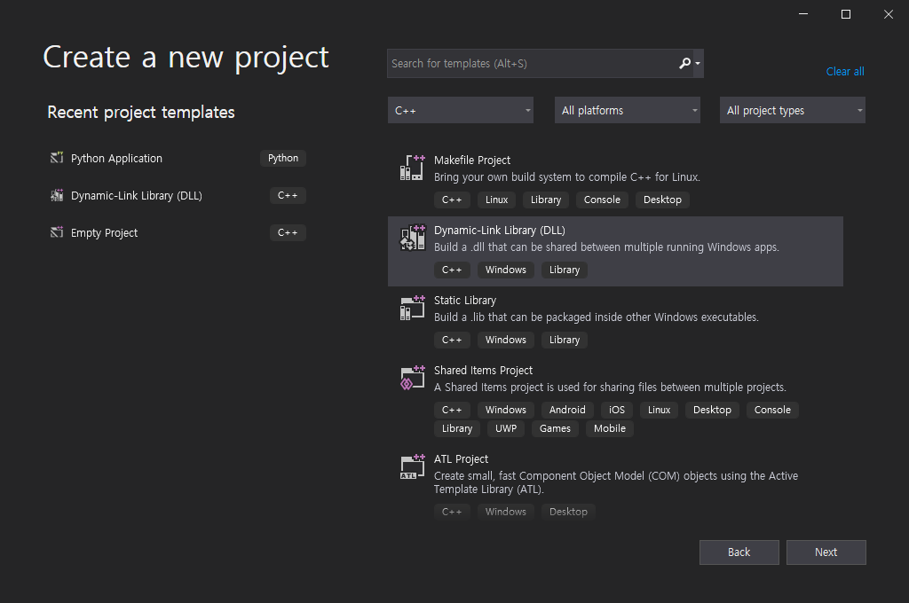
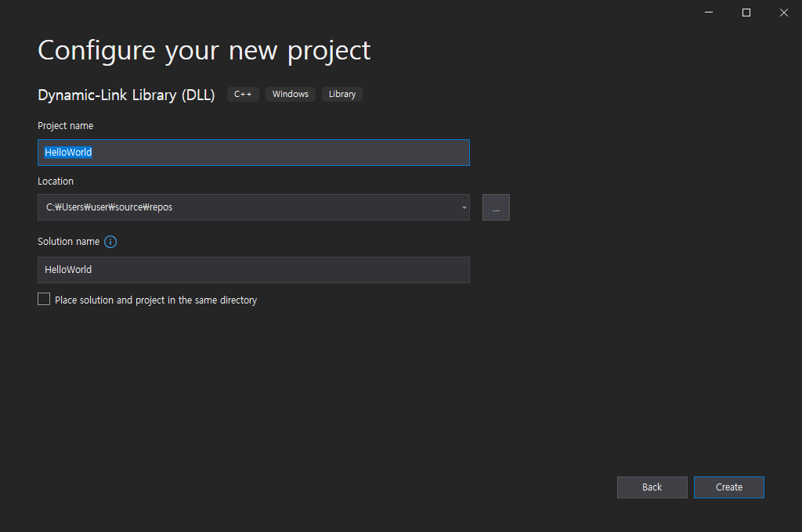
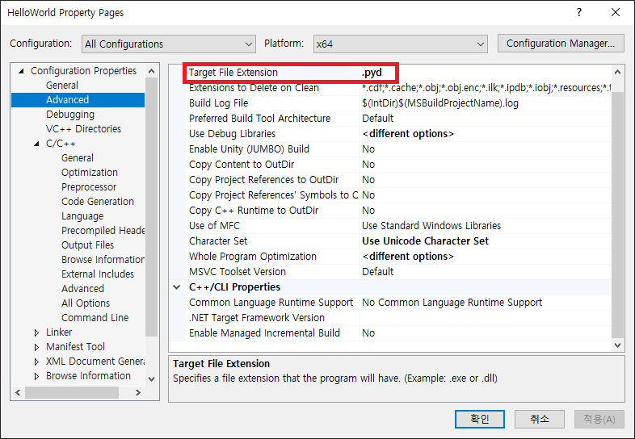
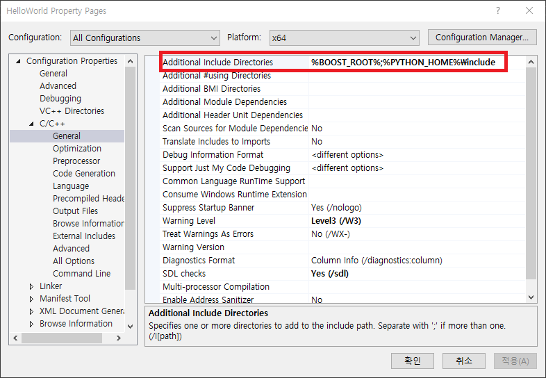
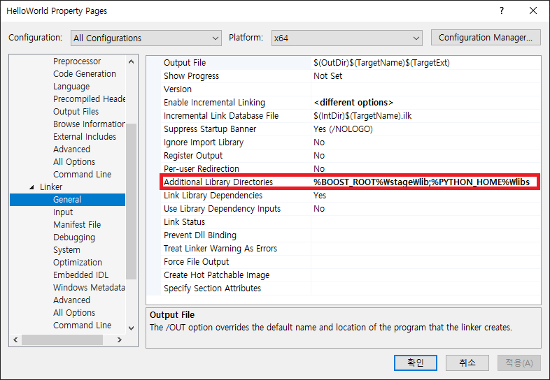

# Overview
Microsoft Visual Studio 에서 Boost Python 라이브러리를 활용하여 C/C++ 함수(라이브러리)를 Python 모듈로 Export 하는 방법을 알아본다.

# Boost C++ Library 설치
## 1. Boost C++ Library 1.76.0 버전을 다운로드한다.
Boost 1.76.0 버전은 https://boostorg.jfrog.io/artifactory/main/release/1.76.0/source/ 에서 다운 받을 수 있다.<br>
위 링크에서 [boost_1_76_0.7z][boost_1_76_0.7z_link] 혹은 [boost_1_76_0.zip][boost_1_76_0.zip_link] 을 다운로드 받은 뒤 압축을 풀어 준다.

## 2. Boost Python Library를 빌드한다.
Boost 라이브러리는 기본적으로 Header-only library로 빌드가 따로 필요없지만 Boost Python 라이브러리의 경우는 빌드가 필요하다.<br>
<br>
압축을 푼 `boost_1_76_0` 폴더로 이동한 뒤 `bootstrap.bat` 을 실행한다.(Windows 기준)<br>
실행이 완료되면 `b2.exe` 파일이 생성된 것을 확인할 수 있다.<br>
<br>
빌드에 사용할 Python 환경을 설정하기 위해 `project-config.jam` 파일을 연다.<br>
`project-config.jam` 파일에 다음과 같은 구문을 추가한다.
``` jam
using python : [version] : [command-or-prefix] : [includes] : [libraries] : [conditions] : [extension-suffix] ;
```
위 구문에 대한 설명은 [여기](https://www.boost.org/doc/libs/1_76_0/tools/build/doc/html/index.html#bbv2.reference.tools.libraries.python)에서 확인할 수 있다.<br>
<br>
필자는 anaconda의 64 bit 3.8 버전의 파이썬을 사용하였으며 다음의 내용을 `project-config.jam`에 추가하였다.
``` jam
using python
: 3.8 # version
: C:/Users/tpdus/anaconda3/python.exe # Interperter/path to dir
: C:/Users/tpdus/anaconda3/include # includes
: C:/Users/tpdus/anaconda3/libs # libs
: <address-model>64 # conditions
;
```
<br>

커맨드 창에서 `boost_1_76_0` 폴더로 이동한 뒤 다음 명령어를 실행한다.
```
.\b2.exe toolset=msvc --build-type=complete --with-python stage
```
<br>

빌드가 성공적으로 완료되면 `boost_1_76_0/stage/lib` 에 `boost_python`으로 시작되는 `.dll`, `.lib` 파일들이 생성된 것을 확인할 수 있다.<br>
<br>
B2의 자세한 사용방법은 [여기](https://www.boost.org/doc/libs/1_76_0/tools/build/doc/html/index.html)에서 확인할 수 있다.

## 3. Boost Python Library Linking
### 3.1. Visual Studio에서 C++ DLL Project를 생성한다.
<br>


### 3.2. Project 설정
#### Target Extension 설정
다음과 같이 프로젝트 설정의 `Advanced - Target File Extension` 에서 Target File Extension을 Python Module Extension인 .pyd로 변경한다.<br>


### Include Path 설정
다음과 같이 Boost C++ Libarary의 Include 경로와 Python의 Include 경로를 추가한다.<br>

위 이미지에서 `%BOOST_ROOT%`는 위에서 다운받은 `boost_1_76_0` 폴더의 경로이며,  <br>
`%PYTHON_HOME%`은 Boost Python 라이브러리를 빌드할 때 설정했던 python.exe가 있는 폴더로 Boost Python 라이브러리 빌드 시 설정하였던 Include 경로와 동일하게 설정하면 된다.<br>

#### Library Path 설정
다음과 같이 위에서 빌드했던 Boost Python 라이브러리와 Python 라이브러리 경로를 설정해준다.<br>

각각 Boost Python 빌드를 통해 생성된 라이브러리 파일이 있는 경로와 Boost Python 빌드 시 설정했던 Python 라이브러리 경로이다.

### 3.3. Python Module 생성
다음 소스코드를 추가한다.<br>
``` c++
// helloworld.cpp
#include "pch.h"
#include <boost/python.hpp>

const char* Greet()
{
    return "Hello World";
}

BOOST_PYTHON_MODULE(HelloWorld) {
    boost::python::def("Greet", Greet);
}
```
위 코드는 C++ `Greet()` 함수를 Python Module `HelloWorld` 에 `Greet` 라는 이름을 export하는 코드이다.

`BOOST_PYTHON_MODULE(HelloWorld)`에서 `HelloWorld` 부분은 export 하려는 모듈 이름으로 Project Name과 동일하게 `HelloWorld` 라는 이름의 모듈을 export할 것을 의미한다.<br>
def 함수의 첫 번째 인자는 파이썬에서 노출되는 이름을 나타내고, 두 번째 인자는 해당 이름으로 노출 시키려는 함수 포인터 혹은 함수를 전달한다.<br>
<br>

위와 같은 소스코드를 추가한 뒤 빌드하게 되면 출력디렉터리에 `HelloWorld.pyd` 라는 이름으로 파이썬 모듈이 생성되는 것을 확인할 수 있다.<br>
해당 디렉터리에 Boost Python 빌드로 생성된 Boost Python DLL 파일을 복사해 준다.<br>(boost_pythonxx 로 시작하는 dll 파일로 Debug 모드로 빌드 한 경우 `gd` 가 파일명이 있는 것을 사용하고, Release 모드로 빌드 한 경우 `gd` 부분이 파일명에서 빠진 dll을 사용한다.)<br>
<br>
빌드된 파이썬 모듈이 있는 디렉터리로 이동해서 파이썬 인터프리터를 실행한 뒤 다음 처럼 생성된 모듈을 임포트한 뒤 `Greet` 함수를 호출 하면 `'Hello Wolrd'` 문자열을 반환하는 것을 확인할 수 있다.
``` python
import HelloWorld

HelloWorld.Greet() # 'Hello World'
```

# C++ Class 내보내기

[boost_1_76_0.7z_link]: https://boostorg.jfrog.io/artifactory/main/release/1.76.0/source/boost_1_76_0.7z
[boost_1_76_0.zip_link]: https://boostorg.jfrog.io/artifactory/main/release/1.76.0/source/boost_1_76_0.zip